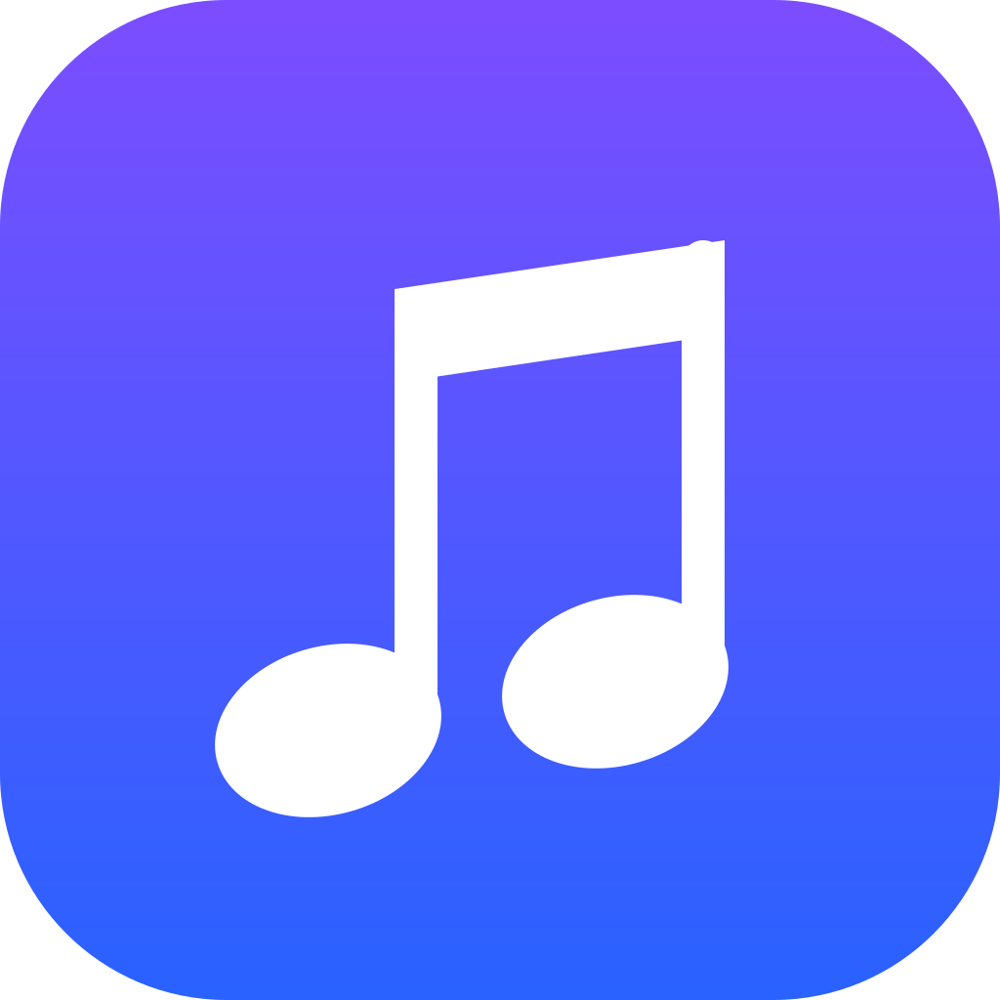

# Free Music

### Aesthetic music client

> [!IMPORTANT]
> Free Music is not affiliated with, endorsed by, or connected to YouTube or Google in any way. Use it at your own discretion.

---

## Features

### Playback
- **Search, browse and play** anything available on YouTube Music.
- **Hi-Res lossless audio** - FLAC/ALAC from a configured module source, with YouTube Music as fallback.
- **Gapless playback with true crossfade**, adjustable 0-12s.
- **Automix [Beta]** - DJ-style transitions with beat-matching and tempo-stretching.
- **Offline downloads** - save tracks with embedded metadata.
- **Local music library** integration.
- **Background playback** via a proper foreground media session.

### Experience
- **Animated album canvas** - motion artwork on the now-playing screen.
- **Word-synced lyrics** - word/syllable-level highlighting from multiple sources.
- **Dynamic, artwork-driven theming** - Material palette extracted from album art.
- **Frosted-glass UI** - Telegram-style translucent bars via Haze, Material 3 theming.

### Connectivity & Accounts
- **Sign in with your Google account** for personalized content.
- **Discord Rich Presence** - in-app login, live track/artist/album and progress.
- **Scrobbling** to Last.fm and ListenBrainz.
- **Pluggable sources** - add, edit, test and health-check module sources.

### Controls & Tweaks
- **Per-network audio quality** - separate quality ceilings for Wi-Fi and mobile data.
- **Playback speed control** (0.5x-2.0x) and **skip silence**.
- **Sleep timer** - fixed presets or "stop after this track".
- **System equalizer** integration.
- **Stats for nerds** - codec, bit depth, sample rate, and more on the now-playing screen.

---

## Download

Grab the latest signed APK from the [Releases](https://github.com/ihimanshunayak/FreeMusic/releases) page. Sideloading requires enabling "Install unknown apps" for whichever app you download it with.

---

## Contributing

Contributions to Free Music are welcome. Please read the [Contributing Guide](CONTRIBUTING.md) and the [Code of Conduct](CODE_OF_CONDUCT.md) before opening a Pull Request.

[**Contributing Guide**](CONTRIBUTING.md) - [**Code of Conduct**](CODE_OF_CONDUCT.md) - [**Maintainers**](MAINTAINERS.md) - [**Additional Docs**](ADDITIONAL.md)

---

## Disclaimer & Legal Notice

Free Music is an independent, community-driven third-party audio player and client. It is **not** associated with Google LLC, YouTube Music, Deezer, Telegram, or any of their parent companies.

* **No Media Hosting:** Free Music does not host, upload, or store copyrighted music files. It operates strictly as an interface to scan local device storage or stream media directly from public, public-facing, or user-authenticated APIs.
* **Fair Use & API Usage:** This software is created solely for personal research, educational, and fair-use purposes. The user is entirely responsible for ensuring their usage aligns with their local copyright laws and the YouTube Terms of Service.
* **No Ad-Blocking Guarantee:** While Free Music focuses on providing a clean listening environment, it does not guarantee permanent bypasses or modifications of commercial third-party platform conditions.
* **Copyleft:** Free Music is free software under the GPLv3. The license does not let anyone forbid others from selling or redistributing copies, but any distribution must come with the Corresponding Source under the same license.

---

## Attribution

Free Music is a rebranded fork. It stands on the work of the original
FreeMusic author and of every upstream project FreeMusic itself builds on -
Orchard, NewPipeExtractor, InnerTubeX, Media3 and ONNX Runtime among others.
Their copyright notices and license terms remain in the source tree exactly
as they were and are not affected by this rebrand. See [LICENSE](LICENSE).

---

## License

Licensed under the **GNU General Public License v3.0 (GPLv3)**. See the [LICENSE](LICENSE) file for details.

---

Maintained by [Himanshu Nayak](https://github.com/ihimanshunayak)

