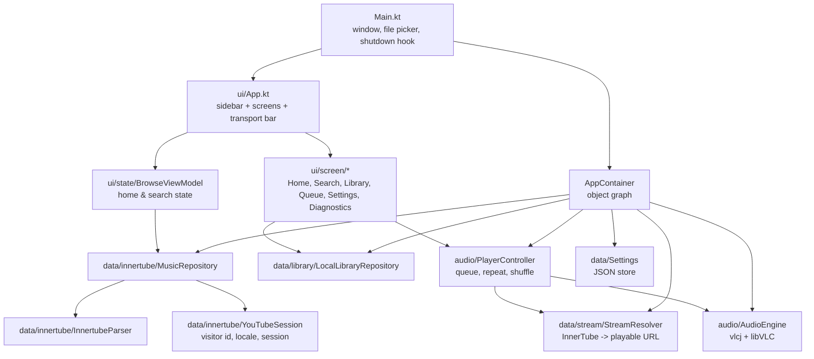

# Free Music for Windows

A native Windows desktop music player built on the same engine as the Free Music
Android app. It streams from YouTube Music, plays your local files, and needs no
account, no API key and no server of its own.

This module is a Compose Desktop application. It shares the Android app's data
layer unchanged and replaces only the parts that are Android-specific.

---

## Table of contents

- [What works today](#what-works-today)
- [Requirements](#requirements)
- [Running from source](#running-from-source)
- [Building an installer](#building-an-installer)
- [Architecture](#architecture)
- [Why the Android data layer runs unchanged](#why-the-android-data-layer-runs-unchanged)
- [Testing](#testing)
- [Troubleshooting](#troubleshooting)
- [Legal](#legal)

---

## What works today

| Area | Status | Notes |
| --- | --- | --- |
| YouTube Music search | Working | Songs, albums, artists, playlists, videos, episodes |
| Search suggestions | Working | Debounced, 220 ms |
| Home / browse shelves | Working | Every carousel the API returns |
| Infinite scroll | Working | Continuation tokens are followed |
| Stream resolution | Working | Progressive and adaptive audio, picked by quality preference |
| Local file library | Working | Recursive folder scan, multiple folders, live track counts |
| Queue management | Working | Add, reorder-by-play, remove, clear, repeat, shuffle |
| Playback | Requires VLC | libVLC is loaded at runtime - see [Requirements](#requirements) |
| Downloads | Working | Any resolved stream can be saved to disk |
| Themes | Working | Light, dark, follow-system |
| Audio quality preference | Working | Low / medium / high / highest |
| Log file + diagnostics screen | Working | Live tail of the rotating log |
| Album art | Working | Memory + disk cache, no flicker while scrolling |

Everything in the table above except playback is already exercised by the unit
tests in this module. Playback degrades gracefully when libVLC is missing: the
window opens, search and library work, and the sidebar says so instead of
crashing.

---

## Requirements

- **Windows 10 or 11**, 64-bit
- **VLC media player 3.x** - required for audio playback

VLC is not bundled. The app loads `libvlc.dll` at runtime through
[vlcj](https://github.com/caprica/vlcj), which searches the standard install
location. Install VLC from [videolan.org](https://www.videolan.org/vlc/) and the
player picks it up on the next start.

Without VLC the app still runs: browse, search, library and queue all work, and
the sidebar reports `VLC not found - playback disabled`. If you prefer a portable
setup, set `VLC_PLUGIN_PATH` and `PATH` to point at an unpacked VLC directory
instead of installing it.

A **JDK 21** toolchain is needed to build. Gradle downloads one automatically via
the Foojay resolver if it is missing, so nothing has to be installed by hand.

---

## Running from source

From the repository root:

```powershell
.\gradlew.bat :desktop:run
```

The first run resolves the Compose and VLC dependencies and prints a window
within roughly a minute.

To point at a specific JDK:

```powershell
$env:JAVA_HOME = "C:\Program Files\Java\jdk-21"
.\gradlew.bat :desktop:run
```

---

## Building an installer

Two installer formats are configured, both produced by the
[JPackage](https://docs.oracle.com/en/java/javase/21/jpackage/) toolchain that
ships with the JDK:

```powershell
# Windows Installer (MSI) - best for managed or unattended installs
.\gradlew.bat :desktop:packageMsi

# Self-contained executable installer (EXE)
.\gradlew.bat :desktop:packageExe
```

Both land in `desktop/build/compose/binaries/main/`. The installer bundles the
application and the JRE it needs; the user does not have to install Java. The
package is called **Free Music**, versioned `1.0.0`, and carries a fixed upgrade
UUID (`8f3c1d64-2b7e-4a19-9c05-6d1b8a7f2e30`) so that a newer build upgrades an
existing installation in place rather than installing side by side.

A distribution image without an installer is also available:

```powershell
.\gradlew.bat :desktop:createDistributable
```

---

## Architecture

The desktop module keeps the Android app's layering so that a fix in one app can
be carried to the other with minimal translation.



`AppContainer` owns the whole graph and is the only place that constructs the
long-lived collaborators. `Main.kt` builds it before the window exists, brings it
up off the UI thread, and tears it down from a shutdown hook so libVLC is released
even when the process is closed from the taskbar.

### Module layout

```
desktop/
  build.gradle.kts
  src/main/kotlin/com/ihimanshunayak/freemusic/desktop/
    Main.kt                 entry point, window, folder picker
    AppContainer.kt         object graph and lifecycle
    model/Models.kt         Track, SearchResult, Playlist, PlaybackState, ...
    data/
      Http.kt               shared OkHttp client, Ktor facade, JSON
      Settings.kt           persisted preferences
      innertube/
        YouTubeSession.kt   InnerTubeX session wrapper
        InnertubeParser.kt  renderer-tree walker
        MusicRepository.kt  browse / search / suggestions
      stream/
        StreamResolver.kt   URL resolution + download
      library/
        LocalLibraryRepository.kt
    audio/
      AudioEngine.kt        vlcj player component
      PlayerController.kt   queue and transport logic
    ui/
      App.kt, Navigation.kt, ImageLoading.kt
      theme/Theme.kt
      state/BrowseViewModel.kt
      component/            Sidebar, NowPlayingBar, shared widgets
      screen/               six screens
    util/Log.kt             rotating file logger + AppPaths
  src/test/kotlin/...       unit tests
```

---

## Why the Android data layer runs unchanged

The expensive part of this app is not the UI, it is talking to YouTube Music.
That work lives in three libraries, and all three are plain JVM code:

| Library | Role | Android dependency |
| --- | --- | --- |
| [InnerTubeX](https://github.com/MetrolistGroup/innertubex) | typed YouTube Music API client | none - the `innertubex-desktop` artifact has no `android/*` or `androidx/*` references |
| [NewPipeExtractor](https://github.com/TeamNewPipe/NewPipeExtractor) | stream extraction and signature deciphering | none |
| [Rhino](https://github.com/mozilla/rhino) | runs the player JavaScript that NewPipeExtractor needs | none |

Only these had to be replaced:

| Android | Desktop | Reason |
| --- | --- | --- |
| ExoPlayer / Media3 | libVLC via vlcj | ExoPlayer is Android-only; libVLC is the established JVM equivalent and decodes the same Opus and AAC streams |
| Jetpack Compose | Compose Multiplatform Desktop | same declarative model, different renderer |
| `Context`-based storage | `AppPaths` under `%LOCALAPPDATA%\FreeMusic` | desktop has no app sandbox |
| Room / SQLite | JSON settings + in-memory library | the desktop app has no database requirement |

Because the API client is the same code, behaviour matches the Android app: the
same visitor-id minting, the same request shapes, the same fallback from adaptive
to progressive streams.

### Verified against the live service

The port is not a port on paper. `.\gradlew.bat :desktop:smokeCheck` exercises the
real integration and, on the machine this was developed on, reported:

```
[PASS] visitor id minted -> 464 chars
[PASS] search('Linkin Park') returns rows -> 29 rows
[PASS] rows carry artwork -> 29 of 29
[PASS] kinds were inferred -> {SONG=7, ALBUM=4, VIDEO=3, PLAYLIST=3, ARTIST=6, EPISODE=6}
[PASS] suggestions return -> [linkin park, linkin park in the end, linkin park numb]
[PASS] home payload arrives -> 191810 chars of JSON
       resolved Inception/Intro ... in 4146ms - itag=139 50463kbps m4a
[PASS] stream declares headers -> User-Agent,Referer,Origin,Accept
[PASS] audio request succeeded -> HTTP 200
[PASS] audio bytes downloaded -> 65536 bytes
[PASS] range request succeeded -> HTTP 206
[PASS] range request served bytes -> 32768 bytes
=== ALL LIVE CHECKS PASSED ===
```

One bug in this report is worth recording, because the check is what caught it.
`ResultKind` was originally derived from `pageType`, which looks like the obvious
signal and is present in every row. It is in fact attached to the *overflow-menu
entries* inside a row ("Go to album", "Go to artist") rather than to the row
itself, so most rows were classified by whichever menu entry the serialiser
happened to emit first - a song row came back as `ALBUM`. The classifier now reads
the row's own subtitle label, then `musicVideoType`, then the navigation endpoint,
and never consults `pageType` at all. Four regression tests pin that down.

---

## Testing

```powershell
.\gradlew.bat :desktop:test
```

The suite covers the parts where a mistake is silent rather than loud:

- **`InnertubeParserTest`** - renderer-tree parsing against captured payload
  shapes, including rows whose text is split across `runs`, carousel tiles, empty
  and malformed responses, and continuation extraction.
- **`StreamResolverTest`** - expiry parsing, quality preference ordering, the
  bitrate fallback for streams whose itag is unmatched, and header construction.
- **`SettingsStoreTest`** - round-trip, missing parent directory, corrupt file,
  empty file, and flow emission.
- **`LocalLibraryRepositoryTest`** - recursive scan against a real temporary
  directory, extension filtering, hidden-file and resource-fork skipping,
  symlink handling, and folder removal.
- **`TrackTest`** - derived properties such as `isStreamable` and
  `durationLabel`.

Tests run on the JVM and need no network access and no VLC installation.

---

## Troubleshooting

**The window opens but nothing plays.**
Install VLC 3.x, or make sure its architecture matches the JVM (a 64-bit JVM
needs 64-bit VLC). The sidebar will say `VLC not found - playback disabled` if
the native library could not be loaded.

**Search returns nothing.**
YouTube intermittently rejects requests. Open the **Diagnostics** screen and
check the log tail; the repository retries transient failures, so a persistent
empty result usually means the endpoint shape changed and the parser needs
updating.

**The library scan misses files.**
Only these extensions are indexed:
`mp3`, `m4a`, `aac`, `flac`, `opus`, `ogg`, `oga`, `wav`, `wma`, `mp4`, `webm`.
Folders are walked to a depth of six levels. Files whose name starts with `.` or
`._` are skipped, and directory symlinks are not followed.

**Where are the logs and settings?**
Everything is under `%LOCALAPPDATA%\FreeMusic\`:

```
%LOCALAPPDATA%\FreeMusic\
  settings.json      preferences
  cache\artwork\     album art cache
  logs\freemusic.log current log (rotates at 2 MB, one previous file kept)
```

**The app reports a version that is not `1.0.0`.**
`APP_VERSION` in `ui/screen/SettingsScreen.kt` is displayed as-is; update it
alongside `packageVersion` in `desktop/build.gradle.kts` when cutting a release.

**A track resolves but playback stops immediately, or a download fails with 403.**
googlevideo binds each media URL to the client that minted it, so the request must
carry the `User-Agent`, `Referer` and `Origin` headers that came with the URL.
`ResolvedStream.headers` exists for exactly this and both the player and the
downloader apply it. A 403 on a single track while others play is usually that
track being unavailable rather than a header problem; the next track will play.

**Verify the upstream integration still works.**
A live end-to-end check is available when the unit tests are not enough, for
instance after a long gap or when search starts returning nothing:

```powershell
.\gradlew.bat :desktop:smokeCheck
```

It mints a real visitor id, runs a real search, follows a real stream URL, reads
bytes from it and repeats the read as a range request. It is kept out of the
`test` task on purpose: a failure there means the upstream contract moved, not
that the build is broken, so it must never gate a commit.

---

## Legal

Free Music is free software under the **GNU General Public License v3.0 or
later**, inherited from the original project. See [`../LICENSE`](../LICENSE).

Free Music is not affiliated with, endorsed by, or sponsored by YouTube or
Google. It uses publicly reachable endpoints, the same way a browser does, and it
does not host, redistribute or re-encode any audio. What you listen to is your
responsibility under the terms of the service you are using.
